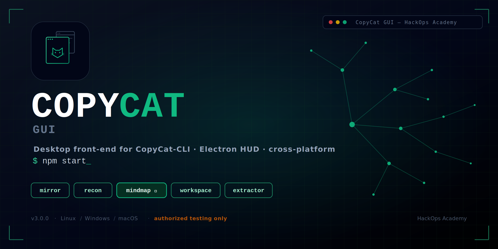
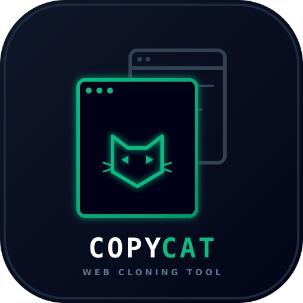

<p align="center">
  
</p>

# CopyCat GUI v3.0



A HUD-themed Electron desktop front-end for **CopyCat-CLI** (Mirror | Recon | Organize),
built for HackOps Academy.

<br clear="left">


> Use only on targets you are authorized to test.

## What's new vs the v2.0 bash script

- **Electron GUI** with a tactical HUD look (dark theme, corner-bracket panels, live
  console log) instead of a terminal menu — same underlying actions, cross-platform
  (Linux/Windows/macOS), frameless custom titlebar.
- **Visual Mindmap tab (new):** renders a force-directed graph — domain → subdomains
  (from certificate-transparency enumeration) → mirrored site structure (folders / pages /
  asset buckets) — using `vis-network`. A quick way to see a target's footprint at a glance
  instead of reading flat `.txt` files.
- **Workspace tab (new):** pick where run folders are written, browse past runs, open any
  run folder in your file manager.
- **Extractor is now standalone (new):** point it at any `mirror/` directory (not just one
  you just created) to re-run endpoint + secret-shaped-string scanning. Results also show
  in a sortable-by-eye table, not just a `.txt` dump. Secret matches are truncated in the
  UI/logs by default — full values are only written to `metadata/secret_candidates.txt`.
- All original logic (wget mirror args, human-readable asset reorganization, crt.sh
  subdomain enumeration, nmap fast scan) was ported from bash to Node so it runs the same
  way on Windows as it did on Kali/Termux.
- **App branding:** custom logo (`assets/logo.svg` / `.png`) used as the taskbar/dock icon
  and titlebar mark, and as the source for electron-builder's generated `.ico`/`.icns` on
  packaged builds.
- **Fixed:** the live-log console used to render as a squeezed flex-row column instead of a
  footer bar, so it could overlap the panels with no way to close it. It's now a proper
  footer with a collapse toggle (chevron, top right of the log) and a drag handle on its top
  edge to resize it.

## Requirements

- [Node.js](https://nodejs.org) 18+
- `wget` on your PATH (used for mirroring — same as the original script)
- `nmap` on your PATH, optional (only needed if you enable the port-scan checkbox in Recon)

## Setup

**Quick setup (Linux/macOS):**

```bash
chmod +x install.sh
./install.sh
```

This checks for Node.js/wget/nmap (offers to install what's missing), runs `npm install`,
and — on Linux — offers to add a CopyCat GUI entry to your applications menu using the
bundled icon, so it launches like any other installed app.

**Manual setup (any OS, including Windows):**

```bash
npm install
npm start
```

## Building a distributable

```bash
npm run dist:linux   # AppImage
npm run dist:win     # portable .exe
npm run dist:mac     # .dmg
```

## Project layout

```
main.js                 Electron main process, window + IPC wiring
preload.js               contextBridge — safe API surface exposed to the renderer
src/index.html            App shell (titlebar, nav rail, panels, console)
src/style.css              HUD theme
src/renderer.js            UI logic, IPC calls, vis-network graph rendering
src/modules/workspace.js    Run-folder management (copycat_<ts>_<domain>/{mirror,scans,metadata})
src/modules/mirror.js       wget mirroring + human-readable reorganization
src/modules/recon.js        crt.sh subdomain enumeration + optional nmap fast scan
src/modules/extractor.js    Endpoint + secret-shaped-string scanning
src/modules/mindmap.js      Builds the node/edge graph consumed by vis-network
```

## Notes on the mindmap

- Node cap is 400 and folder-tree depth is capped at 4 to keep the graph legible on large
  sites — increase `MAX_NODES` / `MAX_STRUCTURE_DEPTH` in `src/modules/mindmap.js` if you
  need more.
- Subdomain data comes from crt.sh certificate-transparency logs (passive, same source the
  original script used) — it reflects domains that have had a TLS cert issued, not a live
  DNS sweep.
